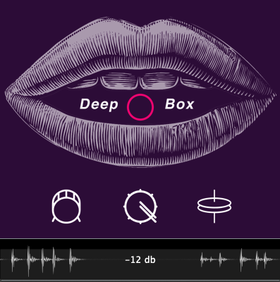

# Deepbox
A Deep Learning Plugin that Classifies Beatboxes and converts to midi in Real Time.

#### Welcome to the Deepbox repository!
Deepbox is an audio plugin that uses a convulutional neural network to classify and predict beatboxes in realtime. You can then create a midi file from the plugin with the corresponding beats. It works at any tempo and conforms to the DAW as it's master tempo.
You can view a demo of Deepbox [here](https://www.youtube.com/watch?v=F6jA0xNGhSM&t=193s).

## Supported Platforms Builds:
AU/VST3
- [macOS](https://drive.google.com/open?id=1qx-z0f922AZaw1bsp64UUH0yLKi9J9M6)

## Model Training:
The model was trained at on audio files with sample sizes of 512.
