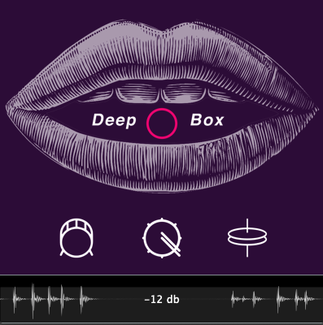

# Deepbox
A Deep Learning Audio Plugin that Classifies Beatboxes and converts to midi in Real Time.

#### Welcome to the Deepbox repository!
Deepbox is an audio plugin that uses a convolutional neural network to classify and predict beatboxes in realtime. You can then create a midi file from the plugin with the corresponding beats. It works at any tempo and uses the DAW as it's master tempo.
You can view a demo of Deepbox [here](https://www.youtube.com/watch?v=F6jA0xNGhSM&t=193s).




## Supported Platforms Builds:
AU/VST3
- [**macOS:**](https://drive.google.com/open?id=1qx-z0f922AZaw1bsp64UUH0yLKi9J9M6) OSX 10.10 and above


## Model Training:
All the code for creating a CNN model is in ```ModelCreation```

1. To Build Your Own Keras Model:

You can run this python file and change the global test and training data variables.

```python CNNAudioClassifer.py```

2. Convert Keras Model into an fdeep json model:

```python ConvertModel.py <input .h5 filename here> <output .json filename here>```


The model used for this plugin was trained with audio sample sizes of 512 samples. 

## Dependencies:

- [Frugally Deep](https://github.com/Dobiasd/frugally-deep): Used for inferencing Keras models in C++ 
- [Essentia](https://github.com/MTG/essentia): Used to extract audio features for training and inference.
- [Juce](https://github.com/WeAreROLI/JUCE): Used as the core audio plugin framework


